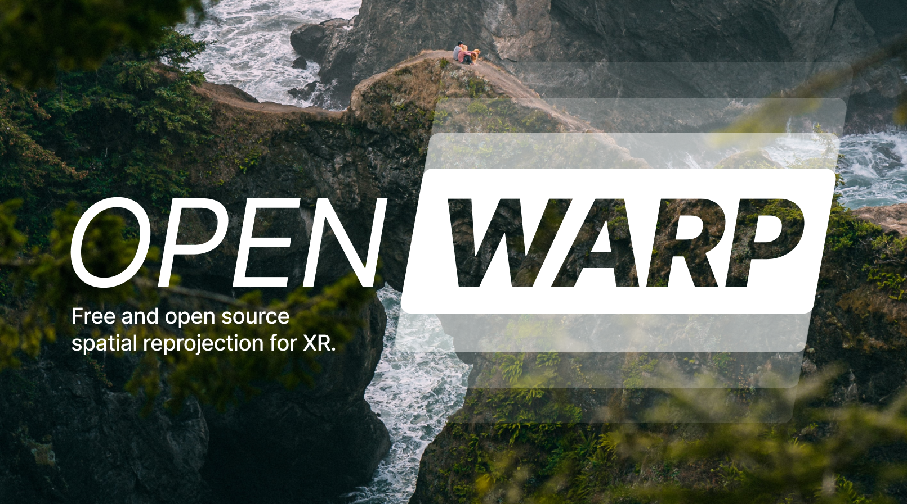

# Overview

Openwarp is the first public implementation of spatio-temporal reprojection, available under a free and open source license. Intended for use in AR/VR runtimes or devices, spatial reprojection can reduce tracking latency, improve the quality and stability of AR objects, and compensate for dropped frames in a client application. The shaders are freely available under the NCSA license, with proper attribution. While several large proprietary runtimes already implement some form of spatial reprojection, Openwarp is the first public, free, and open-source implementation available to developers. 

## Mesh-based and raymarch-based

Openwarp includes two different algorithms for spatial reprojection. One is a mesh-based system, and another is a raymarching-based system. The mesh-based system is typically more performant than the raymarch system (for equivalent quality settings), but can fail to accurately reproject fine details due to the limitation of the mesh resolution. Both algorithms offer several customizable parameters that can be adjusted to the developers' liking, offering tradeoffs between performance, quality, and accuracy.

## Demo Application

Included is a demo application that visualizes the effects and benefits of spatial reprojection. You can switch between the two reprojection algorithms (mesh-based and raymarch-based), as well as adjust the parameters of each reprojection algorithm on the fly. In addition, you can adjust the rendering framerate of the "application", as well as freeze the rendering entirely.